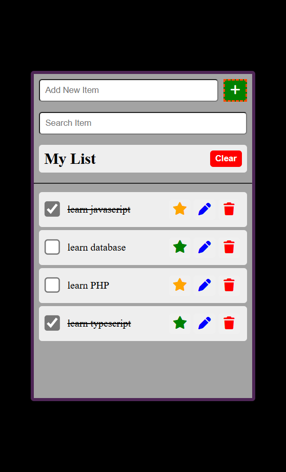
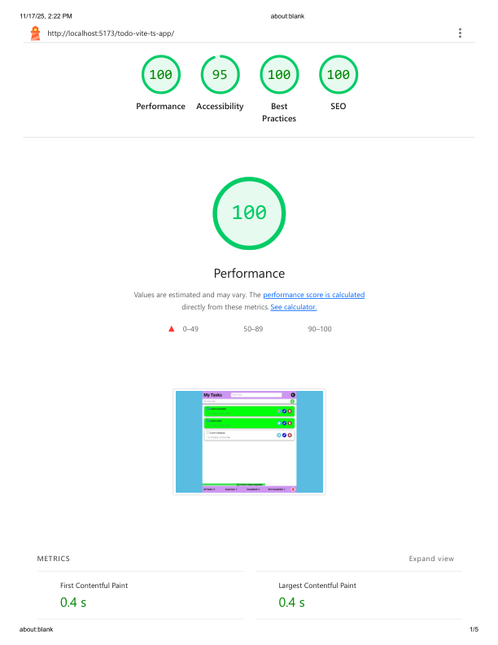

# 📝 Todo App

A simple and responsive **Todo List Application** built with **Vite, TypeScript, JavaScript, HTML, and CSS**.  
It allows users to manage their tasks easily with options to add, update, delete, and filter todos.

---

🚀 Live Demo

👉 https://github.com/ahmednabil22224/todo-vite-ts-app

---

## ✨ Features

- ➕ Add new todos
- ✏️ Update existing todos
- ❌ Delete todos
- ✅ Mark tasks as completed or active
- 🔍 Filter tasks (all, completed, pending)
- 💾 Data persistence with Local Storage

---

## 🛠️ Technologies Used

- **HTML5**
- **CSS3**
- **JavaScript (ES6+)**
- **TypeScript**
- **Vite** (for development & build)

---

```
## 🧩 Folder Structure

todo-vite-ts App/
│
├── index.html
├── public/
│   └── style.css
├── src/
│   ├─main.ts
│   └─model/
│      ├── Item.ts
│      ├── List.ts
│      ├── ListTemplate.ts
│      └── Overlay.ts
│   └─images/
│      ├── screenshot.png
│      └── lighthouse.png
│
├── README.md
└── package.json
```

---

## 📸 Screenshots



---

## 📦 Installation

1. Clone the repository:
   ```bash
   git clone https://github.com/ahmednabil22224/todo-vite-ts-app.git/
   ```

2.Navigate to the project folder:
cd ToDo_vite_Ts

3.Install dependencies:
npm install

4.Run the development server:
npm run dev

---

## 🌟 Lighthouse Report

| Metric            | Score |
| ----------------- | ----- |
| ⚡ Performance    | 100%  |
| ♿ Accessibility  | 100%  |
| 🛡️ Best Practices | 100%  |
| 🔍 SEO            | 100%  |

images/lighthouse-report.png

## ⚡ Lighthouse Report



---

📖 Usage

. Type a task in the input field and press Enter or click Add.

. Click the ✏️ icon to edit a task.

. Click the ❌ icon to delete a task.

. Click the ⭐ icon to important task.

. Click check input to complete task.

. Click clear to clear all tasks.

. Use the filter Search.

---
